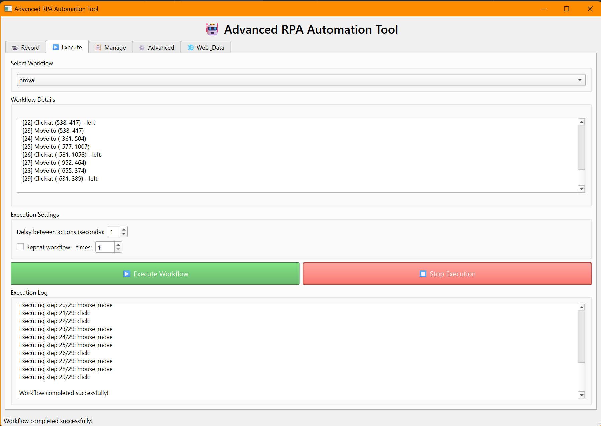

# 🤖 RPA Automation Tool

A powerful and user-friendly Robotic Process Automation (RPA) tool built with Python and PySide6. Automate repetitive tasks, record workflows, and execute complex automation sequences with ease.


## ✨ Features

### 🎯 Core Automation
- **Visual Workflow Recording**: Record mouse clicks, keyboard inputs, and movements
- **Action Management**: Add, edit, delete, and reorder automation steps
- **Screenshot Capture**: Take screenshots at click locations for visual reference
- **Flexible Execution**: Run workflows with customizable delays and loop counts

### 🌐 Web Automation (Selenium)
- Navigate to URLs
- Click web elements (by ID, Name, XPath, CSS, Class)
- Fill out forms automatically
- Extract data from web pages
- Full browser automation support

### 📊 Data Processing
- **Excel Integration**: Read and write Excel files (.xlsx)
- **CSV Support**: Process CSV files with pandas
- **Variable System**: Store and reuse data between actions
- **Multi-sheet Support**: Work with multiple Excel sheets

### ⚙️ Advanced Features
- **Conditional Logic**: Add if-then conditions to workflows
- **Loops**: Repeat actions multiple times
- **Wait Actions**: Add delays and pauses
- **Workflow Management**: Save, load, duplicate, import/export workflows
- **Modern UI**: Clean, intuitive interface with tabbed navigation

## 📋 Requirements

### System Requirements
- Python 3.11 or higher (tested on Python 3.11.9)
- Windows, Linux, or macOS
- 4GB RAM minimum (8GB recommended and tested)
- Screen resolution: 1280x720 or higher

### Python Dependencies

```bash
# Core Dependencies
PySide6
pyautogui
pynput
Pillow

# Web Automation
selenium

# Data Processing
pandas
openpyxl
```

### Additional Requirements for Selenium
- **Chrome**: Download [ChromeDriver](https://chromedriver.chromium.org/)
- **Firefox**: Download [GeckoDriver](https://github.com/mozilla/geckodriver/releases)

Place the driver executable in your system PATH or in the same directory as the script.

## 🚀 Installation

### 1. Clone the Repository

```bash
git clone https://github.com/Rikiza89/rpa-automation-tool.git
cd rpa-automation-tool
```

### 2. Create Virtual Environment (Recommended)

```bash
# Windows
python -m venv venv
venv\Scripts\activate

# Linux/macOS
python3 -m venv venv
source venv/bin/activate
```

### 3. Install Dependencies

```bash
pip install -r requirements.txt
```

### 4. Install WebDriver (for Selenium features)

**Option A: Automatic (Chrome)**
```bash
pip install webdriver-manager
```

**Option B: Manual**
- Download ChromeDriver or GeckoDriver
- Add to system PATH

## 💻 Usage

### Starting the Application

```bash
python RPA2.py
```

### Basic Workflow

#### 1. Recording Actions
1. Go to **Record** tab
2. Configure recording options (mouse movement, screenshots)
3. Click **Start Recording**
4. Perform the actions you want to automate
5. Click **Stop Recording**
6. Enter a workflow name and click **Save Workflow**

#### 2. Adding Manual Actions
1. In the **Record** tab, click **Add Manual Action**
2. Select action type (click, type, wait, etc.)
3. Configure action parameters
4. Click OK to add to workflow

#### 3. Executing Workflows
1. Go to **Execute** tab
2. Select a saved workflow from dropdown
3. Set delay between actions (optional)
4. Enable loop execution if needed
5. Click **Execute Workflow**

#### 4. Web Automation Example
```python
# Navigate to website
Action: web_navigate
URL: https://example.com

# Fill login form
Action: web_type
Selector Type: id
Selector: username
Text: myusername

# Click submit button
Action: web_click
Selector Type: id
Selector: login-button

# Extract data
Action: web_extract
Selector Type: css
Selector: .result-text
Variable: result_data
```

#### 5. Data Processing Example
```python
# Read Excel file
Action: excel_read
File Path: data/input.xlsx
Sheet Name: Sheet1
Variable: excel_data

# Process data (add your logic)

# Write to new file
Action: excel_write
File Path: data/output.xlsx
Sheet Name: Results
Data Variable: excel_data
```

## 📁 Project Structure

```
rpa-automation-tool/
│
├── RPA2.py                 # Main application file
├── workflows.json          # Saved workflows (auto-generated)
├── requirements.txt        # Python dependencies
└── README.md              # This file
```

## 🎨 Features Overview

### Recording Tab
- Start/Stop recording controls
- Mouse movement capture toggle
- Screenshot capture on click
- Real-time action list
- Manual action addition
- Action editing and deletion

### Execute Tab
- Workflow selection dropdown
- Detailed workflow preview
- Configurable execution delay
- Loop execution option
- Real-time execution log
- Progress tracking

### Manage Tab
- List all saved workflows
- Workflow information display
- Duplicate workflows
- Import/Export workflows (JSON)
- Delete workflows

### Advanced Tab
- Conditional actions (if-then)
- Loop constructs
- Wait/delay actions
- Screenshot capture
- Tips and best practices

### Web & Data Tab
- Selenium web automation
- Excel file operations
- CSV file processing
- Variable management

## 🔧 Configuration

### Workflow File Format

Workflows are saved in JSON format:

```json
{
  "name": "Example Workflow",
  "created": "2025-01-15T10:30:00",
  "action_count": 3,
  "actions": [
    {
      "type": "click",
      "x": 500,
      "y": 300,
      "button": "left",
      "timestamp": "2025-01-15T10:30:05"
    },
    {
      "type": "type_text",
      "text": "Hello World",
      "interval": 0.01,
      "timestamp": "2025-01-15T10:30:07"
    },
    {
      "type": "key",
      "key": "enter",
      "timestamp": "2025-01-15T10:30:10"
    }
  ]
}
```

## 🐛 Troubleshooting

### Common Issues

**1. Selenium WebDriver Error**
```
Solution: Install ChromeDriver/GeckoDriver and add to PATH
```

**2. Screen Resolution Issues**
```
Solution: Adjust coordinates in actions or re-record workflow
```

**3. Import Errors**
```bash
# Reinstall dependencies
pip install --upgrade -r requirements.txt
```

**4. Black Text Not Showing**
```
Solution: Check system theme settings and restart application
```

## 🤝 Contributing

Contributions are welcome! Please follow these steps:

1. Fork the repository
2. Create a feature branch (`git checkout -b feature/AmazingFeature`)
3. Commit your changes (`git commit -m 'Add some AmazingFeature'`)
4. Push to the branch (`git push origin feature/AmazingFeature`)
5. Open a Pull Request

### Development Guidelines
- Follow PEP 8 style guide
- Add docstrings to new functions
- Test on multiple platforms
- Update README with new features

## 📝 License

This project is licensed under the GNU General Public License v3.0 (GPL-3.0) - see the [LICENSE](LICENSE.md) file for details.

### Why GPL-3.0?
This project uses LGPL-licensed dependencies (PySide6, pynput), which require GPL-compatible licensing. 
The GPL-3.0 ensures:
- Full compliance with all dependencies
- Your freedom to use, modify, and distribute
- Protection of open-source principles

### Third-Party Licenses
- **PySide6**: LGPL 3.0
- **pynput**: LGPL 3.0
- **PyAutoGUI**: BSD 3-Clause
- **Pillow**: PIL License
- **Selenium**: Apache 2.0
- **pandas**: BSD 3-Clause
- **openpyxl**: MIT

## 👤 Author

**Rikiza89**
- GitHub: [@Rikiza89](https://github.com/Rikiza89)

## 🙏 Acknowledgments

- [PySide6](https://wiki.qt.io/Qt_for_Python) - Qt for Python
- [PyAutoGUI](https://pyautogui.readthedocs.io/) - Cross-platform GUI automation
- [Selenium](https://www.selenium.dev/) - Browser automation
- [pandas](https://pandas.pydata.org/) - Data analysis library
- [pynput](https://pynput.readthedocs.io/) - Input device control

## 📊 Roadmap

- [ ] Image recognition for robust UI automation
- [ ] OCR integration for text extraction
- [ ] Database connectivity (SQL)
- [ ] API integration support
- [ ] Cloud workflow storage
- [ ] Multi-language support
- [ ] Workflow scheduler
- [ ] Mobile automation support

## 📞 Support

For support, please:
1. Check the [documentation](docs/)
2. Search existing [issues](https://github.com/Rikiza89/rpa-automation-tool/issues)
3. Create a new issue with detailed information

## ⭐ Star History

If you find this project useful, please consider giving it a star!

---

**Note**: This tool is for automation of legitimate tasks. Always respect website terms of service and robots.txt when automating web interactions.

## 📸 Screenshots

### Main Interface


### Recording Actions


### Workflow Execution


### Advanced Options


### Web and Data options


---

Made with ❤️ by Rikiza89
